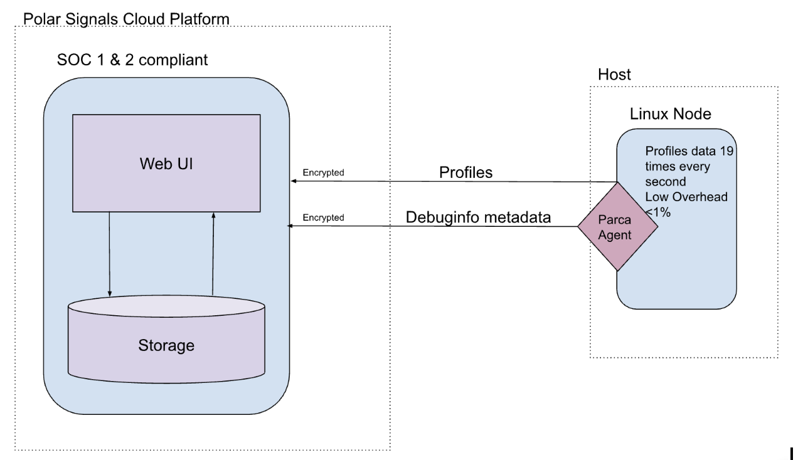

# Agent Deployment Guide

## Understanding the Polar Signals Architecture

Polar Signals provides a cloud platform for continuous profiling, helping teams gain deep visibility into their applications' performance. At the core of this system is the Polar Signals Agent, which must be deployed as a DaemonSet on various hosts to collect profiling data efficiently. The agent communicates with the server via **gRPC**, ensuring high-performance, low-latency data transmission for seamless profiling insights.

**Continuous Profiling** takes a different approach compared to traditional profiling. Instead of capturing short bursts of high-resolution data, it continuously profiles every process in your infrastructure at a relatively **low sampling frequency (19Hz)**. This method ensures that enough data is gathered over time to build **statistical significance** while maintaining a **low overhead of less than 1%** with the Polar Signals Agent.

<BrowserWindow>

</BrowserWindow>

 

## Deployment Options

Below is a table outlining the available deployment options for the Polar Signals Agent across different host types:

| Host Type   | Description                                                                | Setup Guide          |
|------------|----------------------------------------------------------------------------|----------------------|
| Kubernetes | Deploy the agent as a DaemonSet to profile workloads running on a Kubernetes cluster. | [Kubernetes Setup Guide](https://www.polarsignals.com/docs/setup-collection-kubernetes) |
| Docker     | Run the agent as a standalone container to profile applications within a Docker environment. | [Docker Setup Guide](https://www.polarsignals.com/docs/setup-collection-docker) |
| Snaps      | Use Snapcraft packaging to deploy the agent on systems that support Snaps, such as Ubuntu-based distributions. | [Snaps Setup Guide](https://www.polarsignals.com/docs/setup-collection-snaps) |
| ECS        | Install the agent on Amazon ECS (Elastic Container Service) to monitor containerized workloads efficiently. | [ECS Setup Guide](https://www.polarsignals.com/docs/setup-collection-ecs) |

For detailed instructions on deploying the Polar Signals Agent, follow the links in the table above.
