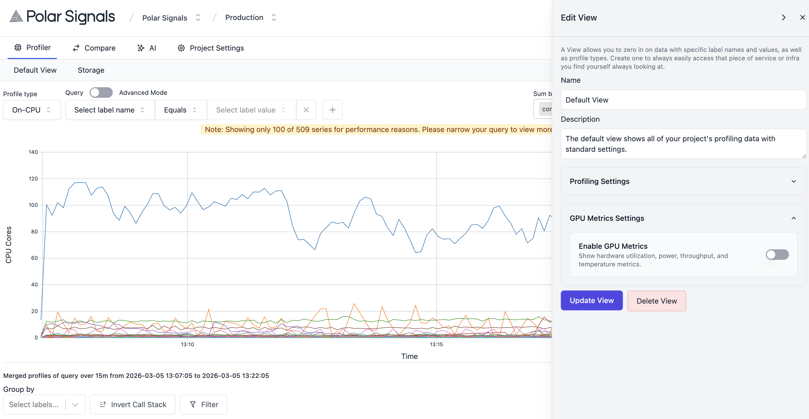
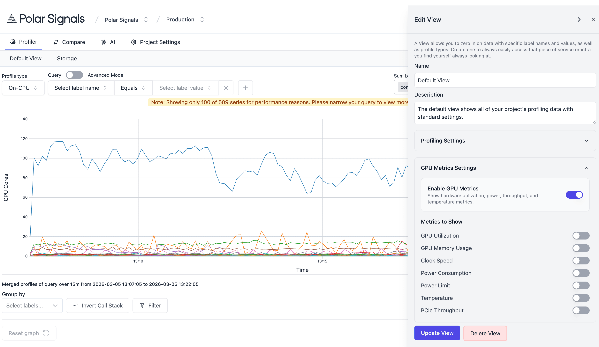

import BrowserWindow from "@site/src/components/BrowserWindow";

# Configure GPU Metrics Visualization

This guide explains how to enable and configure GPU hardware metrics in the Polar Signals dashboard. Once configured, the profiler will display metrics like GPU utilization, GPU memory usage, e.t.c alongside your CPU profiling data.

## Prerequisites

- Access to a Polar Signals Cloud project
- A profiling view (e.g., "Default View") already created
- GPU-enabled infrastructure being profiled (e.g., NVIDIA GPUs)
- The [Polar Signals GPU Metrics Agent](/docs/setup-collection-kubernetes-gpu) deployed and running

## Steps

### 1. Open the Edit View Sidebar

In the upper-right corner of the profiler interface, click the **View Settings** button (gear icon).

This opens the Edit View sidebar on the right side of the screen.

### 2. Navigate to GPU Metrics Settings

Once the Edit View sidebar is open, scroll down past the following sections:

- **Profiling Settings** (Profile Type, Enforce profile type, Pre-filter for label values, Sum-by labels)
- **Advanced Options** (Streamline repetitive filtering, Group by labels, Filters)

You will reach the **GPU Metrics Settings** section near the bottom of the sidebar.

<BrowserWindow>

</BrowserWindow>

### 3. Enable GPU Metrics

Inside the GPU Metrics Settings section, you'll find a primary toggle:

| Setting            | Description                                                            |
| ------------------ | ---------------------------------------------------------------------- |
| Enable GPU Metrics | Show hardware utilization, power, throughput, and temperature metrics. |

Click the toggle switch to turn it on.

### 4. Enable Individual Metrics

<BrowserWindow>

</BrowserWindow>

After enabling the main GPU Metrics toggle, the **Metrics to Show** subsection becomes active. Enable each metric by clicking its individual toggle switch.

| Metric            | Description                                     |
| ----------------- | ----------------------------------------------- |
| GPU Utilization   | Percentage of GPU compute capacity in use       |
| GPU Memory Usage  | Amount of GPU Memory currently consumed         |
| Clock Speed       | Current GPU core/memory clock frequencies (GHz) |
| Power Consumption | Current GPU power draw                          |
| Power Limit       | Configured maximum power limit for the GPU      |
| Temperature       | GPU temperature (°C)                            |
| PCIe Throughput   | Data transfer rate across the PCIe bus          |

### 5. Save Changes

At the bottom of the Edit View sidebar, click the **Update View** button.

The sidebar will close automatically and the view will refresh with the new GPU metric graphs enabled.
