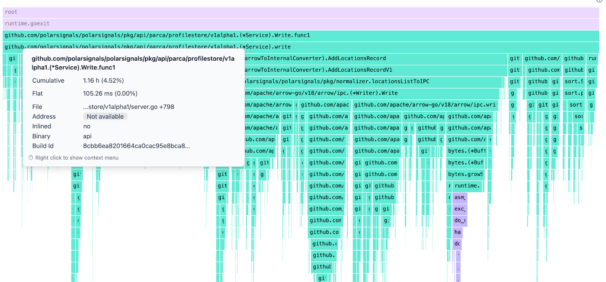

# Understanding Cumulative vs. Flat CPU Time

import BrowserWindow from "@site/src/components/BrowserWindow";

When analyzing performance data, it’s important to understand the difference between **Cumulative** and **Flat** CPU time:
* **Cumulative Time:** This represents the total CPU time used by a function and all the functions it calls (i.e., its children). It gives you a complete view of the overall cost associated with that function in the call stack.

* **Flat Time:** This is the CPU time used only by the function itself, not including any time spent in its children. It helps you identify the actual cost of that specific function's own operations.

## A Note on Leaf Functions

Leaf functions (those that don’t call any other functions) are always 100% responsible for their cumulative time—because they have no children, all their time is self-contained.
If a parent function’s cumulative time is larger than the sum of its children’s cumulative times, that means the parent itself is also doing some work—allocations, processing, or other operations—not just delegating to its children.

## Example Scenarios

* `Write`  is doing some of the work itself: With a flat time of 105.26ms, a portion of the total CPU time is from operations directly within `write`.
* Most of the cost is from its children: The remaining ~1.15h of the cumulative time is spent in child functions. In particular:
`AddLocationRecord` and `AddLocationRecordv1` are significant contributors.
* This pattern shows that while `write` initiates the work, the heavy lifting is distributed across its child functions.
  
<BrowserWindow>

</BrowserWindow>

 

Understanding these metrics helps you pinpoint where CPU time is really going—whether a function is expensive on its own or just passing the cost down to its children.

