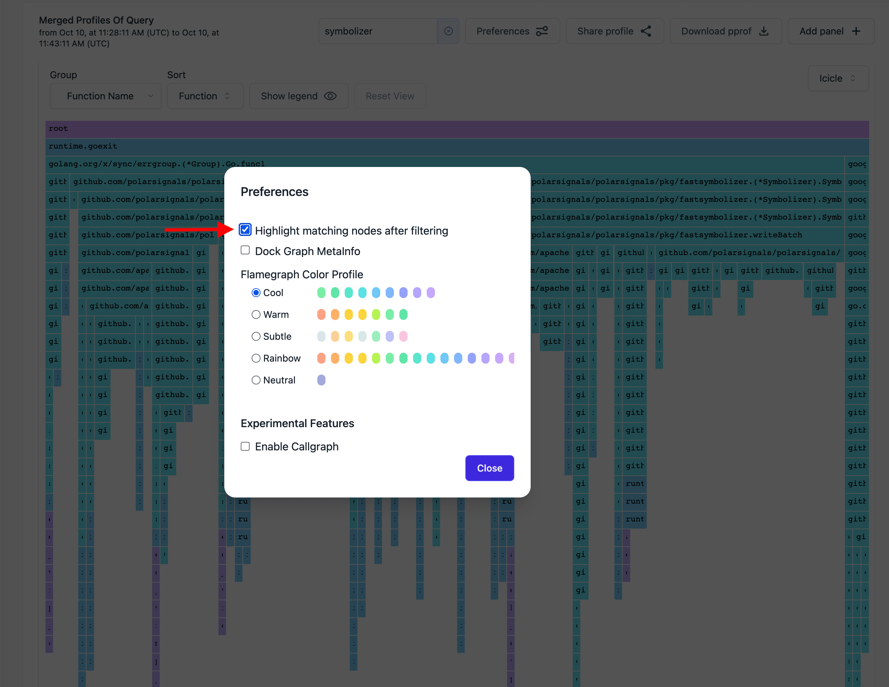

# Filter By Function

import BrowserWindow from "@site/src/components/BrowserWindow";

Polar Signals allows filtering profiles by function name. This is useful to narrow down the scope of a profile to a specific function or set of functions.
It is valuable for gaining insight into the performance of a particular function or comprehending how a set of functions interacts with a specific one.

### How it works

The function filtering feature sifts through the samples, retaining only those that contain at least one node that matches the provided text pattern. This text pattern can be a portion of a function name or a package name, and the filter is not case-sensitive.

### How to use it

Locate the input box labeled "Filter by function" located in the visualization bar above the Flame Graph. Enter the desired text pattern and hit the "Enter" key. The flame graph will then be updated to display only the samples that include at least one function matching the specified text pattern.

<BrowserWindow>

</BrowserWindow>

The picture below shows the result of filtering with pattern `symbolizer`. The flame graph shows only the samples that have at least one node matching the `symbolizer` text.

<BrowserWindow>

</BrowserWindow>

 
This way, you can filter the samples to show only the ones that are of interest to
you when you're troubleshooting a performance issue.

### Highlight matching nodes

Additionally, you have the option to emphasize nodes that correspond to a specific text pattern. This feature aids in comprehending the interactions between the matching nodes and the overall graph. To activate this functionality, simply select the "Highlight matching nodes after filtering" checkbox in the preferences modal.

<BrowserWindow>

</BrowserWindow>

 
This is what the flame graph looks like after enabling the "Highlight matching nodes
after filtering" feature.

<BrowserWindow>

</BrowserWindow>
