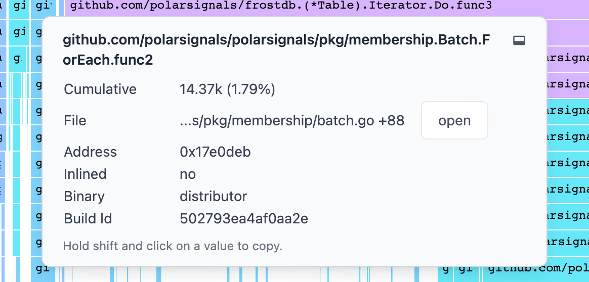
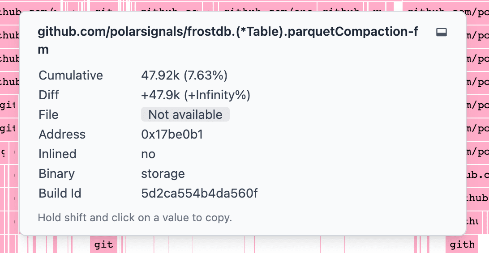

# Graph Tooltip Details

import BrowserWindow from "@site/src/components/BrowserWindow";

Here are some detailed explanations of the information that is displayed in the graph tooltip.

<BrowserWindow>

</BrowserWindow>

## Cumulative

This is the total number of times the function has been called. This is the sum of all the samples that have been collected for this function. The graph visually presents the cumulative samples as a continuous line.

## Diff

In compare mode, the Diff value shows the variance in samples between the current graph and the compared graph. A positive value indicates more function calls in the current graph, while a negative value indicates more calls in the compared graph. If the function call count is the same in both graphs, the Diff value is omitted.

<BrowserWindow>

</BrowserWindow>

## File

The name of the file that the function is in. If the file is not in the project, it will be displayed as an absolute path. If the file is in the project, it will be displayed as a relative path. If you've [uploaded the source code](upload-source) to our servers, you can click on `open` button to open the file in the source code viewer and see profiling data inlined with your code.

## Address

The memory location of the function. It serves as a reference to the function's position in memory. The addresses are presented in hexadecimal format and start with the prefix `0x`.

## Binary

The name of the binary that the function is in. Using the [Binary-based Color Stack](https://www.parca.dev/docs/icicle-graph-binary-based-colour-stack) feature, you can identify the most expensive binaries in the rendered flamegraph.

## Build ID

The build ID of the binary that the function is in. The build ID is a unique identifier for the binary. It is used to match the binary to the debug information that is stored in the symbol server.

## Inlined

This is used to indicate that the function was inlined. The value is either "Yes" or "No".
