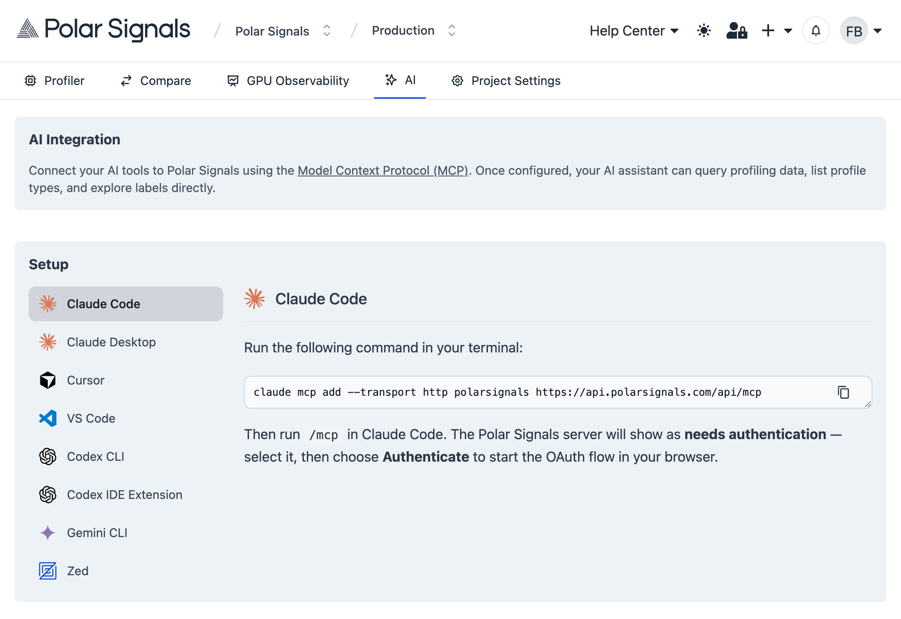

import WithVersions from '@site/src/components/WithVersions';
import CodeBlock from '@theme/CodeBlock';

# MCP Support

Polar Signals provides a Model Context Protocol (MCP) server that enables AI assistants to connect directly with performance profiling data sources. This transforms performance analysis by allowing natural language queries about application performance data.

## What is MCP?

The Model Context Protocol enables AI assistants to securely connect to external data sources and tools. With Polar Signals' MCP server, you can:

- **Analyze performance data using natural language**: Ask questions like "What are the main CPU bottlenecks?" or "Show memory allocation patterns"
- **AI-driven code optimization**: Get specific suggestions for improving performance based on profiling data
- **Explore profiling data**: Discover available profile types, labels, and values in your projects

## Setup

Head to the "AI" section of the Polar Signals dashboard to get started. Follow the instructions to connect your MCP client and authenticate securely.

<BrowserWindow>

</BrowserWindow>

## Usage Examples

Once configured, you can ask natural language questions about your profiling data:

- "What are the main CPU bottlenecks in my application?"
- "Show me memory allocation patterns for the last hour"
- "Which functions consume the most CPU time?"
- "Analyze the performance profile and suggest optimizations"

The MCP server will translate your questions into precise profile queries and provide actionable insights for performance optimization. 

## Available Tools

The Polar Signals MCP server provides the following tools:

- `get_projects`: List all projects your account has access to
- `profile_types`: Discover available profile types in your project
- `labels`: Explore metadata labels in profiles  
- `values`: Get specific label values for filtering
- `get_profile`: Query profiles using PromQL syntax

