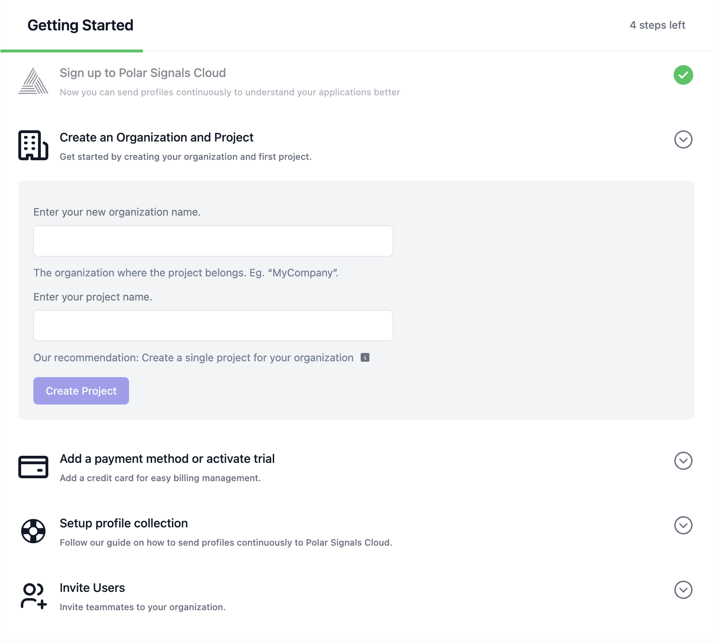
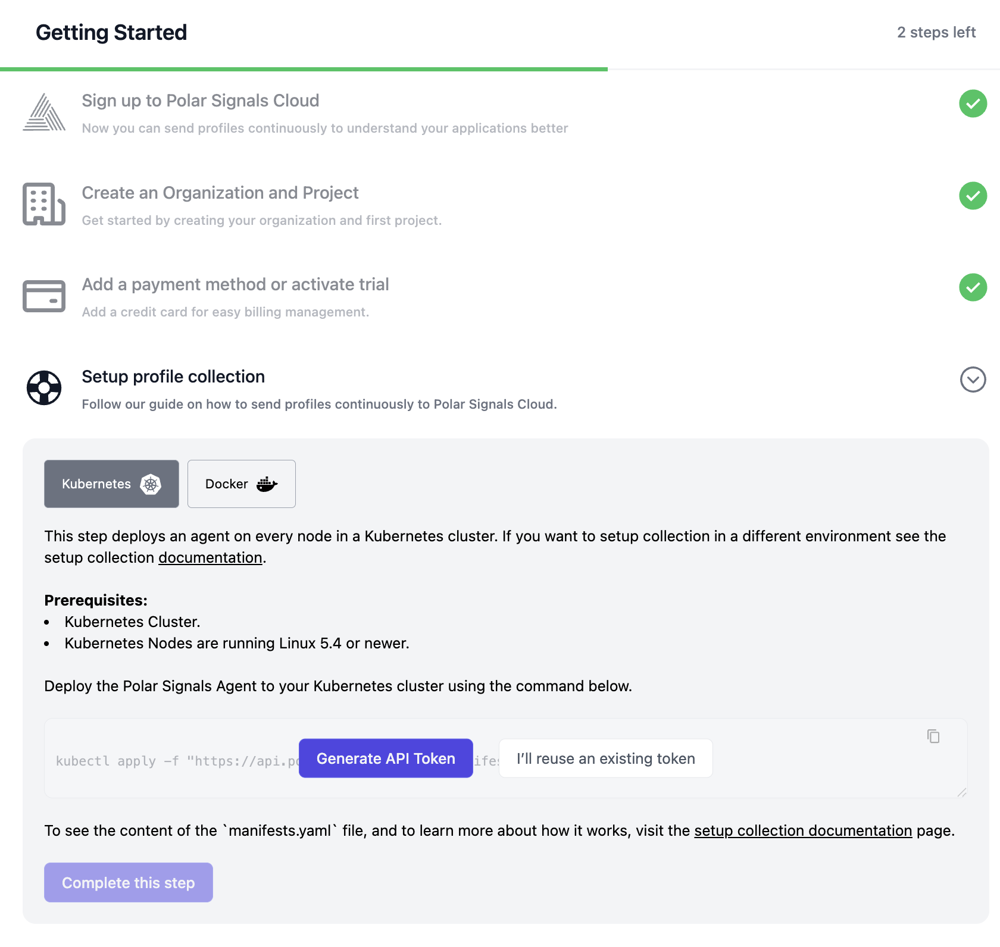

import BrowserWindow from "@site/src/components/BrowserWindow";

# Quick Start Guide to Sign Up

## Get Started in Just a Few Steps!

Setting up your Polar Signals account is quick and easy. In just a few steps, you'll be up and running, ready to gain deep insights into your application performance.

## What You Need to Sign Up

To create your account, you'll need:

* **Organization Name** – Identify your company or team.
* **Project Name** – Define the project you want to monitor. Unless there is a very specific reason for separation, we recommend having a single project for all data. Projects are the tenancy boundary, and you will not be able to query data across projects.
* **Credit Card Information** (Optional) – You can enter your payment details now or activate our 14-day free trial with no upfront commitment.
* **Agent** – Set up the profiling collection agent to start gathering data.
  
<BrowserWindow>

</BrowserWindow>

 

## Setting Up the Agent

Our profiling collection runs as a DaemonSet, ensuring it installs seamlessly across all your containers. To set up the agent host, you’ll need a machine running Linux 5.4 or newer. Since most of our customers use Kubernetes or Docker, we provide installation instructions for both below.

<BrowserWindow>
  

</BrowserWindow>

 

For additional agent deployment options, refer to .
