# Views

import BrowserWindow from "@site/src/components/BrowserWindow";

The **Views** feature enables you to create custom filters that focus on specific profiling data based on labels or attributes. This provides a structured and efficient way to analyze the data that matters most to you.

**Key benefits:**

- **Reduce noise**: Filter out irrelevant data to focus on what matters.
- **Save time**: Avoid repetitive filtering by pre-configuring common queries.
- **Team collaboration**: Share standardized views across your organization.
- **Targeted analysis**: Create purpose-built views for specific components or environments.

## When to use Views

Views are particularly useful in these scenarios:

- **Multi-service applications**: Create separate views for each microservice or container.
- **Environment separation**: Maintain distinct views for development, staging, and production.
- **Team workflows**: Set up views tailored to different team responsibilities.
- **Incident investigation**: Quickly switch to pre-configured views that isolate problematic components.

## How to create a View

By default, you start with a single global view named "Default View" that encompasses all profiling data. This is useful for an overarching perspective, but as your data grows, creating specific Views becomes essential for targeted analysis.

To create a new View, navigate to your dashboard, at the right end of the **Views** tab, click the New View button. This should open a **Drawer** that appears on the right side of the screen, allowing you to customize its details.

<BrowserWindow>

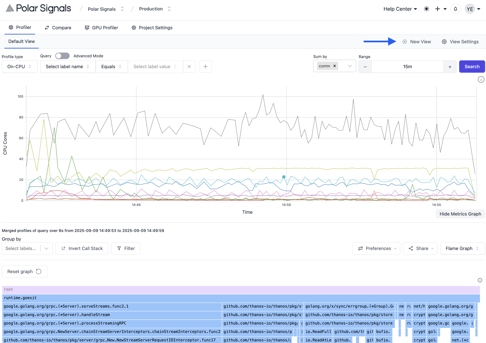

</BrowserWindow>

 

 

<BrowserWindow>

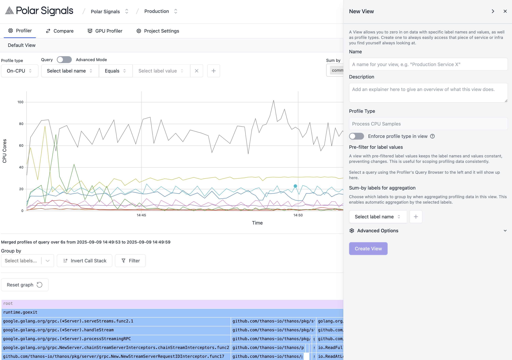

</BrowserWindow>

 

### How to pre-filter for label values

When creating a View, you can pre-filter for specific label names and values. This is particularly useful when you want to focus on a specific subset of your profiling data. For example, if you want to analyze data from a specific container, you can set a pre-filter for the `container` label with the value `api`.

To do this, query as you normally would in the **Profiler** to the left, and the label names and values will be available in the **View** creation drawer.

<BrowserWindow>

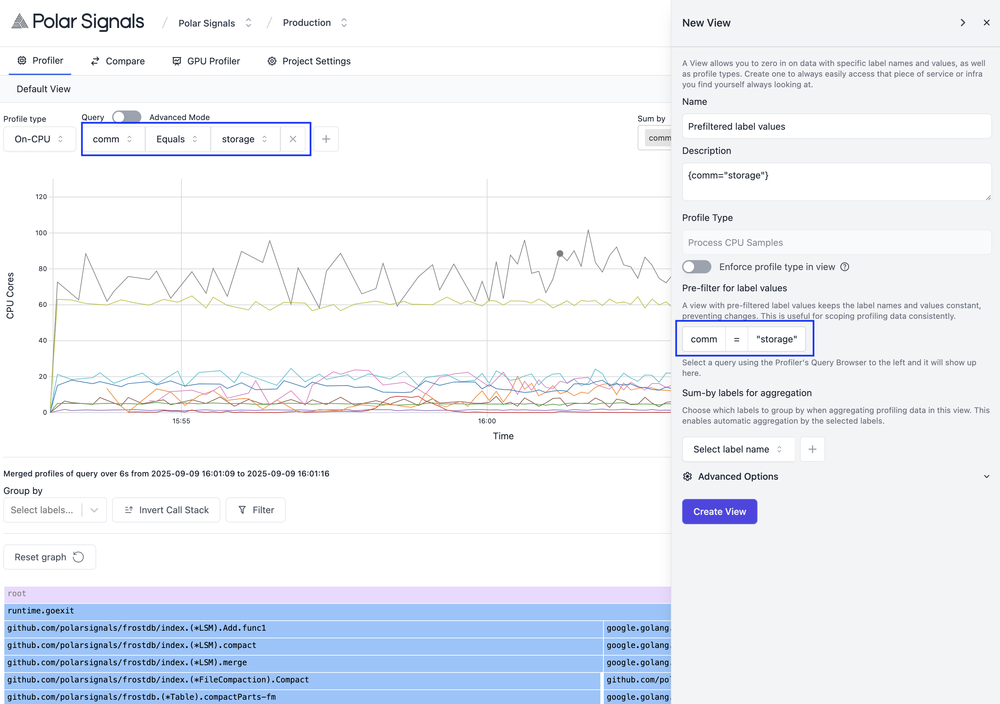

</BrowserWindow>

 

Create the view by clicking the **Create View** button at the bottom of the drawer and you will be redirected to the newly created view and also see the view appear in the **Views** tab list.

<BrowserWindow>

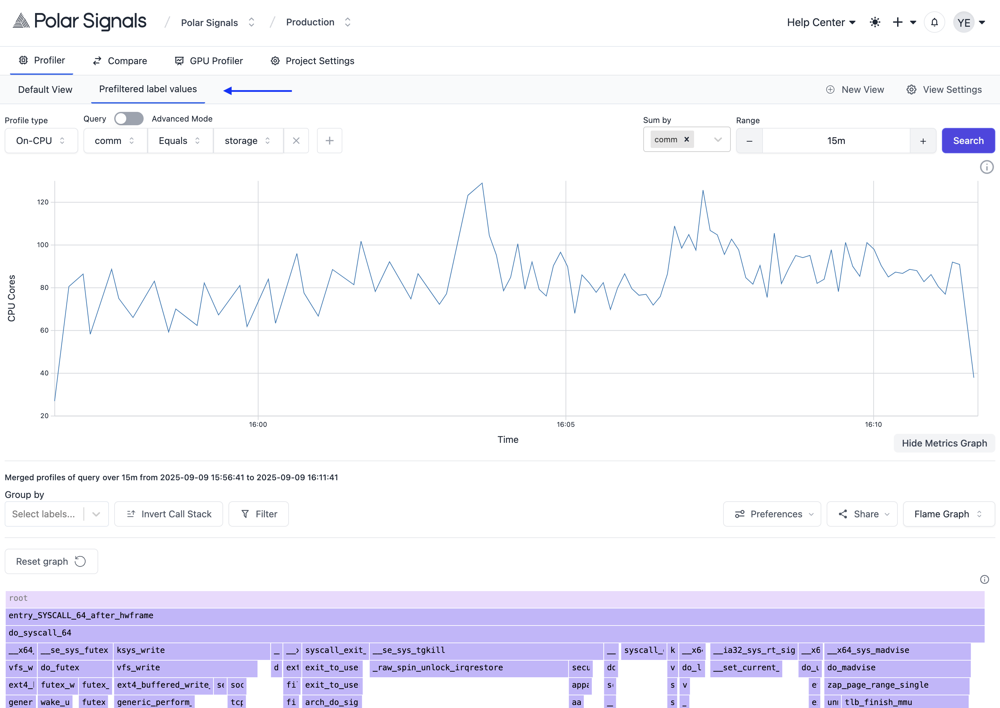

</BrowserWindow>

 

### How to enforce profile type in view

If you'd like to lock in a specific profile type for a view, you can do so by selecting the desired profile type from the **Profile type** dropdown in the **Profiler** and then clicking on the **Enforce profile type in view** toggle in the view creation drawer. This ensures that whenever you access this view, it will always use the selected profile type.

<BrowserWindow>

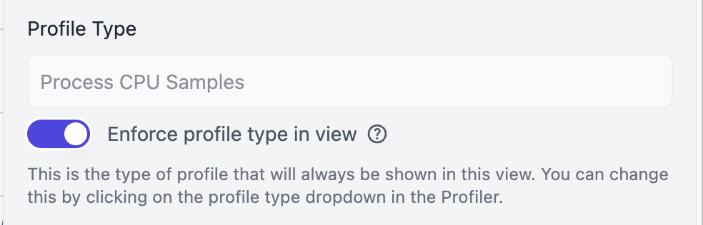

</BrowserWindow>

 

### How to set up sum-by labels for aggregation

When creating a View, you can also specify which labels to sum by for aggregation. This allows you to group your profiling data by specific label names and compute aggregated metrics.

To set up sum-by labels, simply add the desired label names to the **Sum-by labels for aggregation** field in the view creation drawer. You can include multiple labels to create a multi-dimensional aggregation.

<BrowserWindow>

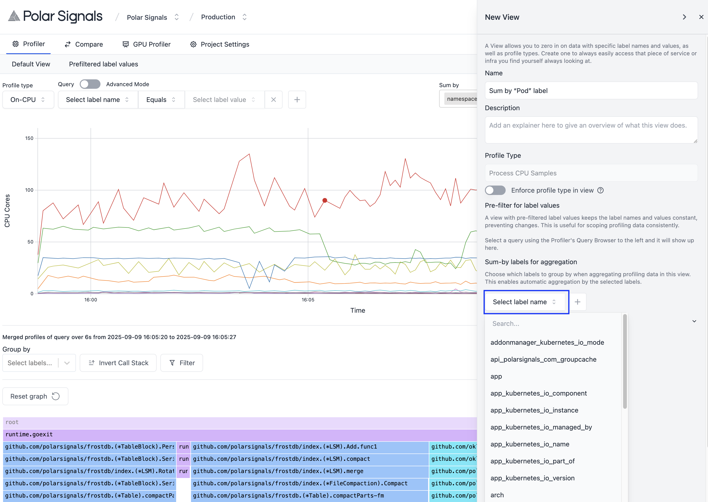

</BrowserWindow>

 

Now any query made in this view will automatically include the specified sum-by labels for aggregation.

<BrowserWindow>

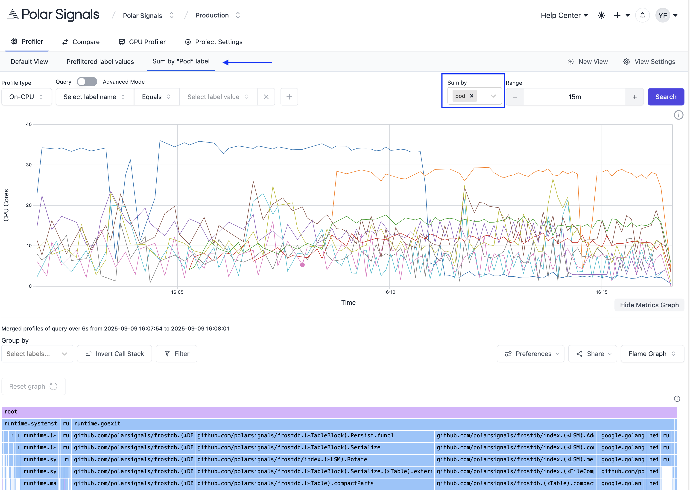

</BrowserWindow>

 

### How to streamline repetitive filtering

If your team always filters by the same labels (service, environment, job, etc.), you can streamline your view by only allowing querying by these labels. This helps to reduce noise and makes it easier to focus on the relevant data.

To streamline repetitive filtering, add the desired label names to the **Streamline repetitive filtering** field in the view creation drawer.

<BrowserWindow>

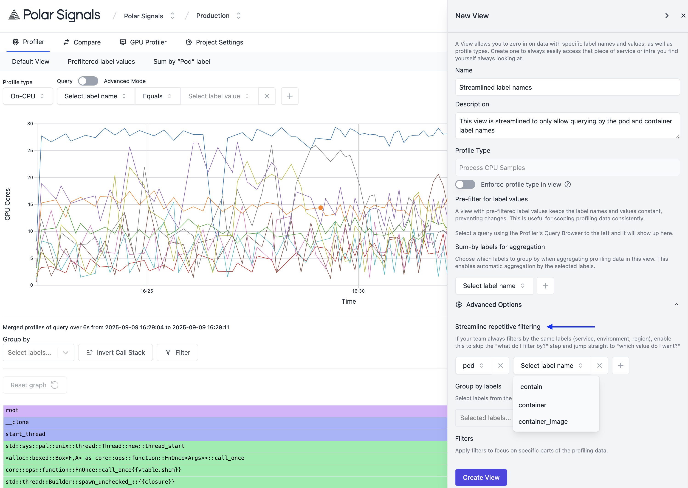

</BrowserWindow>

 

Now you'll see the specified labels in the Query section of the **Profiler** when you're in this view, and all you have to do is select the values you want to filter by.

<BrowserWindow>

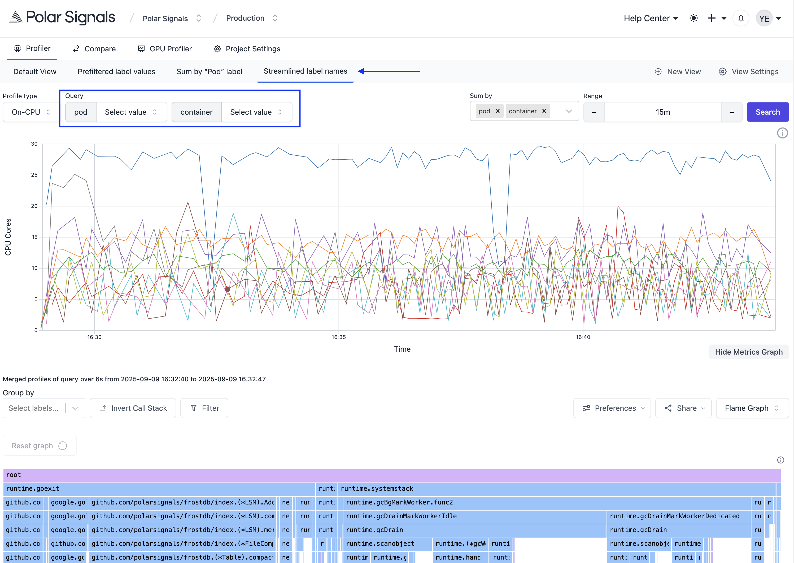

</BrowserWindow>

 

> _**TIP**: Add a description to your view for your teammates (or yourself) to know what a view is for and when the view name is hovered on, it shows the description._

<BrowserWindow>

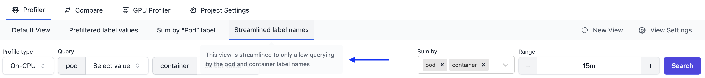

</BrowserWindow>

 

### How to set up group by labels for aggregation

If you frequently group your profiling data by specific labels, you can set these labels in the **Group by labels** field when creating a view. This ensures that any query made within this view will automatically include these labels for grouping.

To set up group-by labels, simply add the desired label names to the **Group by labels for aggregation** field in the Profiler and it will appear in the view creation drawer.

<BrowserWindow>

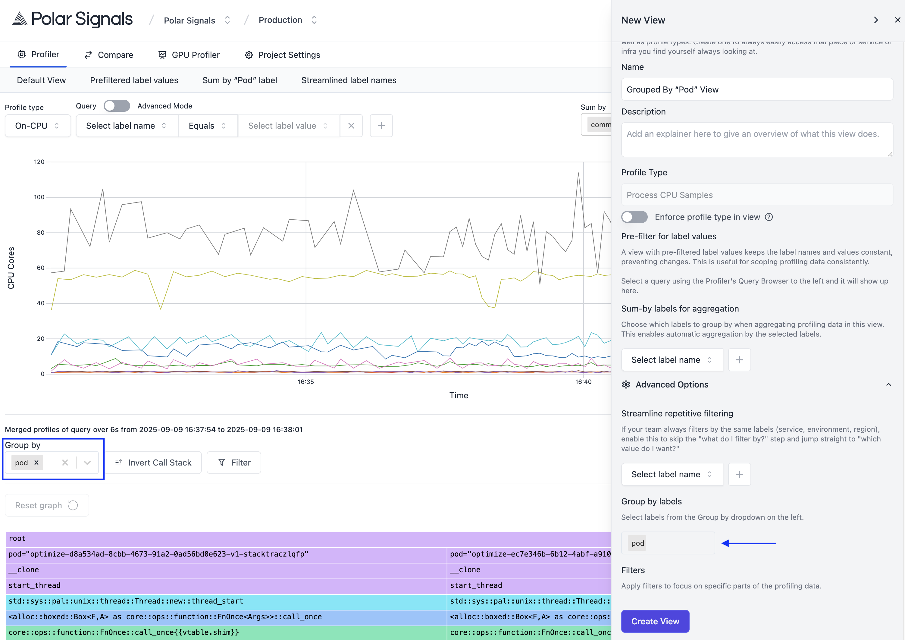

</BrowserWindow>

 

Now any query made in this view will automatically include the specified group-by labels for aggregation.

<BrowserWindow>

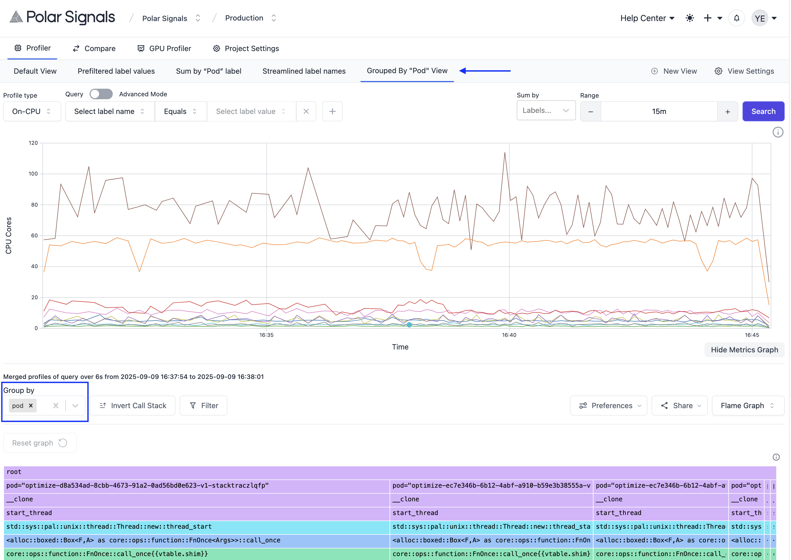

</BrowserWindow>

 

### How to create views with filters

When profiling, you might use the **Filters** feature to narrow down your data by searching for a function or by applying filter presets. If you find yourself frequently applying the same filters, you can save time by creating a view that includes these filters by default.

To set up Filters in the view, simply filter for a function or apply a filter preset in the Profiler and it will appear in the view creation drawer.

<BrowserWindow>

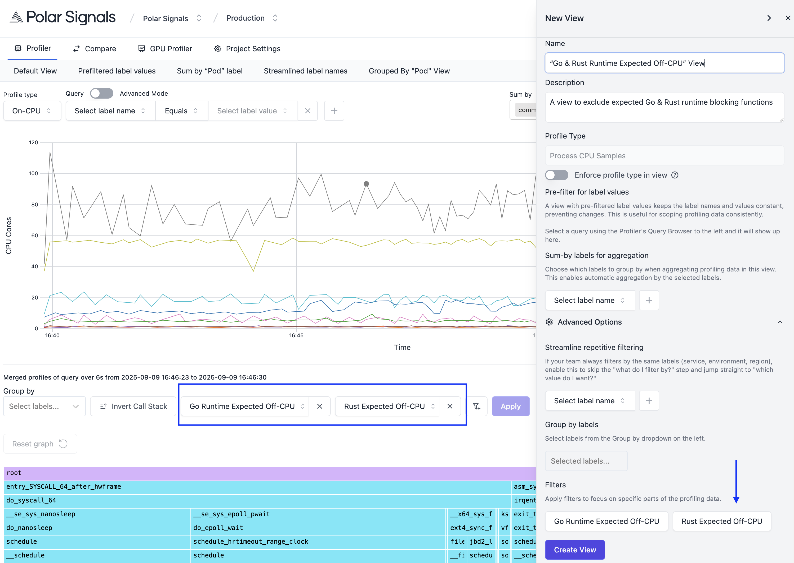

</BrowserWindow>

 

Now any query made in this view will automatically include the specified filters.

<BrowserWindow>

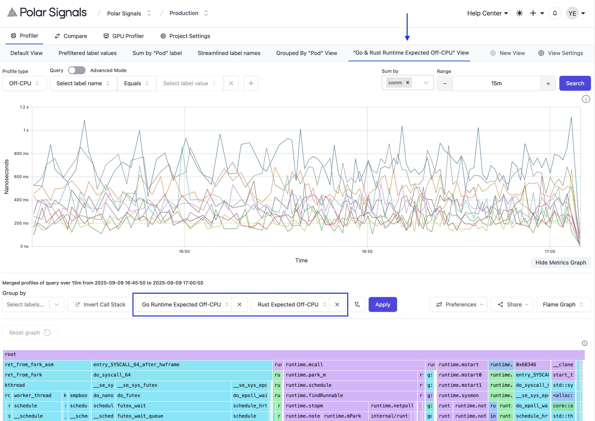

</BrowserWindow>
