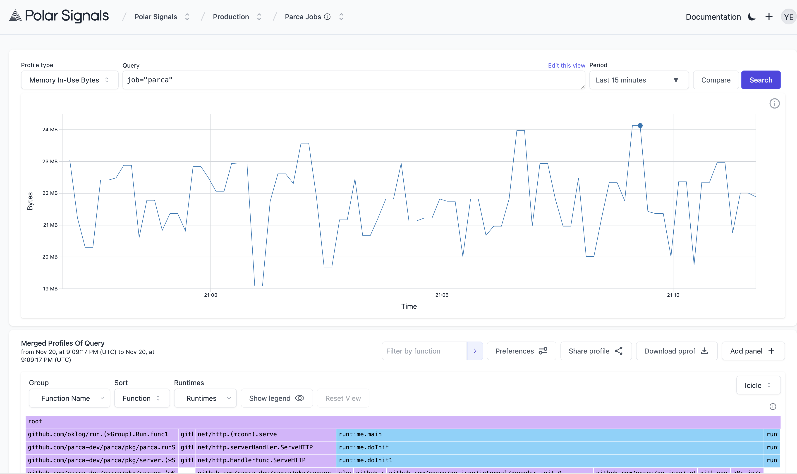

# Views

import BrowserWindow from "@site/src/components/BrowserWindow";

The "Views" feature empowers you to create custom "Views" that serve as filters, allowing you to zero in on data with specific labels or attributes.

This feature offers a tailored and organized approach to browsing specific profiling data through predefined filters. Imagine wanting to focus solely on data labeled with `container="storage"`. With the Views Feature, you can effortlessly create a filter that narrows down your profiling data to the elements that matter most to you. Whether you're interested in app servers, databases, Kubernetes nodes, or other specific aspects of your software, Views offer a more organized and granular approach to analysis.

To create a new view, head to your dashboard, and navigate to the New View button by hovering over your active project .

<BrowserWindow>

</BrowserWindow>

 
Or you can type in a label name and value into the query browser and then a "Create
a view from this query" button will appear.

<BrowserWindow>

</BrowserWindow>

 
Using any of the above options will display a Drawer to the right where you can enter
details about the View like the name, description and the actual query. You can also
choose to include the Profile Type in the View.

<BrowserWindow>

</BrowserWindow>

 
And after creating the view, you'll be redirected to the view where you can see the
data you've filtered for.

<BrowserWindow>

</BrowserWindow>
