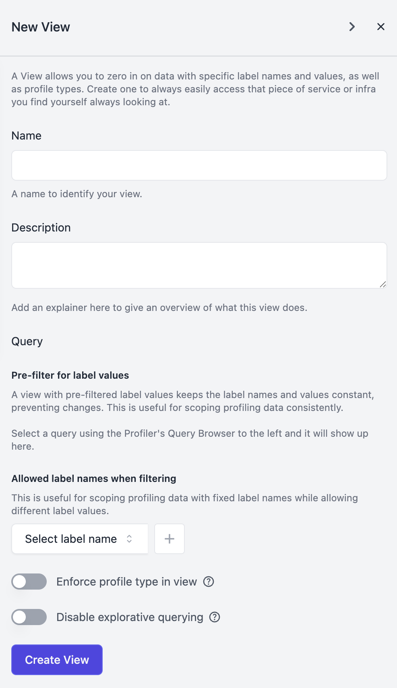

# Views Polar Signals 

import BrowserWindow from "@site/src/components/BrowserWindow";

The **Views** feature enables you to create custom filters that focus on specific profiling data based on labels or attributes. This provides a structured and efficient way to analyze the data that matters most to you.
For example, if you want to examine only the data labeled `container="storage"`, you can easily set up a View to filter out irrelevant details and streamline your analysis. Whether you're working with application servers, databases, Kubernetes nodes, or other infrastructure components, Views help you organize and refine your profiling insights with precision.

## How to Create a View

To create a new View, navigate to your dashboard, hover over your active project, and click the New View button. From there, you can define your filters and tailor the view to your needs.

<BrowserWindow>

</BrowserWindow>

 

Another way to create a **View** is by entering a label name and value directly into the query browser. Once you've constructed your query, a **"Create a view from this query"** button will appear, allowing you to save it as a View.

<BrowserWindow>

</BrowserWindow>

 

Regardless of how you create a **View**, a **Drawer** will appear on the right side of the screen, allowing you to customize its details. Here, you can define the name, description, query, and profile type, along with labels that can be used for filtering. Labels help scope profiling data by fixing specific label names while allowing flexibility in label values. For example, you can define labels such as container and pod to refine your analysis further, ensuring your View captures only the most relevant data. These labels can later be used as filters to narrow down profiling data during analysis.

<BrowserWindow>

</BrowserWindow>

At the bottom of the Drawer, you'll find two toggle options:

* **Enforce Profile Type in View** – When enabled, this ensures that the profile type remains fixed within the View, preventing changes while you analyze data.
* **Disable Explorative Querying** – When enabled, this restricts the use of the free-form query browser, limiting analysis to predefined filters. The labels defined earlier, such as `container` and `pod`, serve as these predefined filters, ensuring analysis stays focused on relevant data points.

<BrowserWindow>

</BrowserWindow>

 
These options provide greater control over your analysis, ensuring consistency and focus within your Views.
After creating a View, you'll be redirected to it, where you can immediately explore the filtered data.

